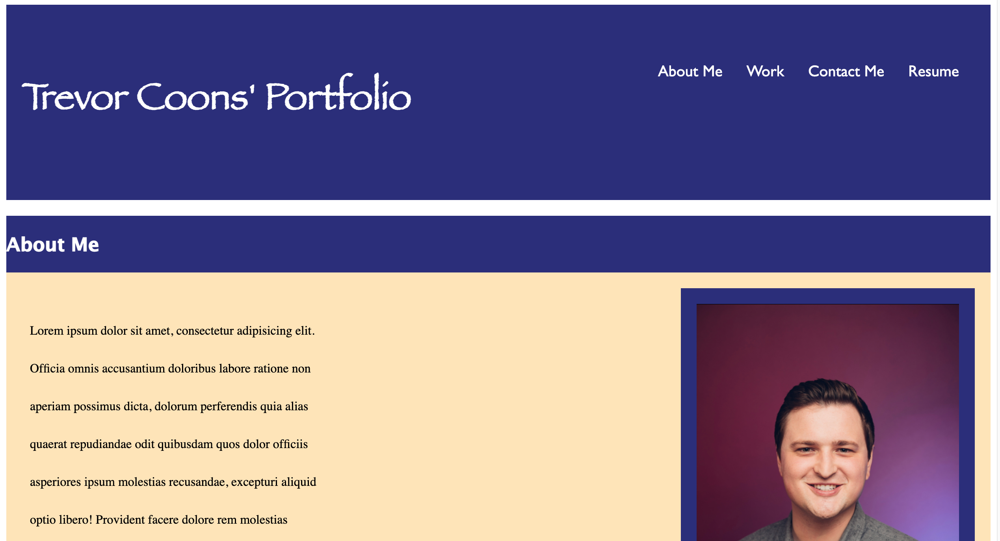
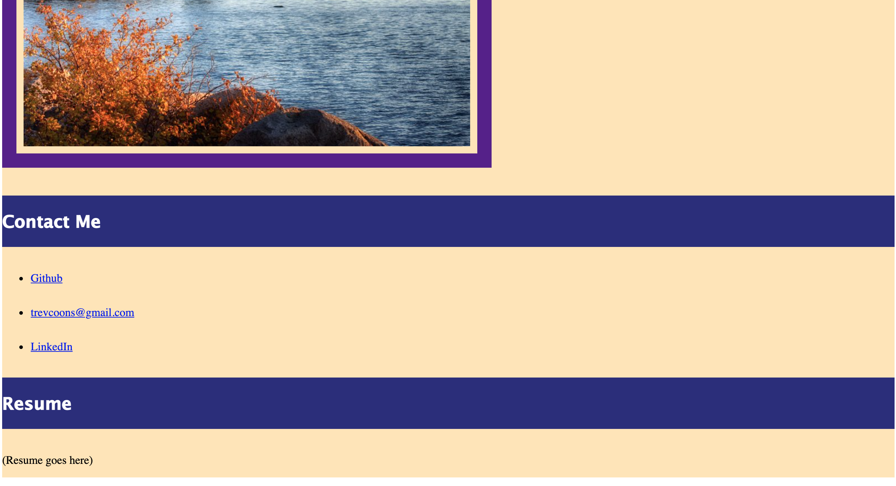

# trevors-portfolio# 
This is the homepage for my portfolio. Included are sections named about me, work, contact me, and resume.

## Functionality

My portfolio homepage features a navigation bar in the header which directs users to sections they are named for.

## Deployed Link

* [TC Portfolio](https://trevcoons.github.io/trevors-portfolio/)

## References

* [HTML](https://www.w3schools.com/html/default.asp)
* [CSS](https://www.w3schools.com/css/default.asp)

## Acknowledgments

Thanks to UC Berkeley Coding Bootcamp for teaching me HTML and CSS.